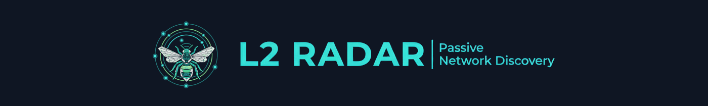

<p align="right">
  <a href="https://code.claude.com/docs/en/" target="_blank">
    
  </a>
  <a href="https://github.com/msune/l2radar/actions" target="_blank"></a>
</p>

<p align="center">
  
</p>

<p align="center">
  <em>(Mostly) generated <a href="https://code.claude.com/docs/en/" target="_blank">Claude Code</a> · Directed & reviewed by a human </em> 🧑
</p>

<p align="center">
</p>

> [!WARNING]
> The project is still in alpha state!

# 📡 `l2radar`

**Passive L2 neighbour monitor powered by eBPF.** See every device on your
network — MACs, IPs, vendors — without sending a single packet.

L2 Radar attaches eBPF probes to your network interfaces via
[TCX ingress](https://docs.kernel.org/bpf/), silently observes regular traffic,
ARP and NDP traffic, and presents everything in a slick dark-themed dashboard.

## ✨ Features

- 🐝 **eBPF-powered** — zero packet injection, zero interference, zero overhead
- 🔍 **ARP + NDP parsing** — discovers IPv4 and IPv6 neighbours automatically
- 🏭 **OUI vendor lookup** — resolves MAC addresses to manufacturer names
- 🌐 **Web dashboard** — real-time, searchable, sortable, mobile-friendly
- 🔒 **HTTPS + auth** — TLS and basic auth out of the box

## 🚀 Quick Start

**1. Install `l2rctl`:**

```bash
curl -fsSL https://raw.githubusercontent.com/msune/l2radar/latest/install-l2rctl.sh | bash
```

To install a specific version:

```bash
curl -fsSL https://raw.githubusercontent.com/msune/l2radar/latest/install-l2rctl.sh | bash -s -- v0.1.0
```

**2. Start everything:**

```bash
l2rctl start
```

**3. Open the dashboard:**

👉 **https://localhost** (accept the self-signed cert)

That's it! L2 Radar is now watching all your external interfaces. 🎉

## 📖 Usage

```bash
# Start only the probe (headless)
l2rctl start probe --iface eth0 --iface wlan0

# Start with custom TLS certs
l2rctl start --tls-dir /etc/mycerts --user admin:secret

# Check what's running
l2rctl status

# Dump the neighbour table from the terminal
l2rctl dump --iface eth0

# Stop everything
l2rctl stop
```

### Interface Keywords

| Keyword | Meaning |
|---------|---------|
| `external` (default) | All external interfaces (skips docker, veth, bridges) |
| `any` | Every non-loopback L2 interface (includes docker, veth, bridges) |

## 🏗️ Architecture

L2 Radar has three components:

| Component | Container | What it does |
|-----------|-----------|-------------|
| **eBPF Probe** | `l2radar` | Attaches to NICs, writes neighbour data to BPF maps, exports JSON |
| **Web UI** | `l2radar-ui` | nginx + React dashboard, serves JSON data read-only |
| **l2rctl** | _(host binary)_ | Orchestrates the containers via Docker CLI |

The probe and UI communicate through **JSON files on a shared volume** — no
network calls between them.

```
 ┌──────────────────────┐        /tmp/l2radar/          ┌──────────────────────┐
 │     eBPF Probe       │       neigh-eth0.json         │       Web UI         │
 │                      │──────────────────────────────▶│                      │
 │  TCX ingress hooks   │      neigh-wlan0.json         │  nginx + React SPA   │
 │  ARP/NDP parsing     │──────────────────────────────▶│  auto-refresh polls  │
 │  JSON export loop    │         (read-only)           │  OUI vendor lookup   │
 └──────────────────────┘                               └──────────────────────┘
        privileged                                          ports 443 (80)
        --network=host                                      unprivileged
```

📚 **[Full architecture docs →](docs/architecture.md)**

## 📋 Requirements

- Linux with kernel **6.6+** (for TCX)
- Docker
- Go 1.24+ (for installing `l2rctl`)

## 🛠️ Development

TODO

## 📄 License

BSD 2-Clause. eBPF code (`probe/bpf/`) is dual-licensed BSD-2-Clause OR
GPL-2.0. See [LICENSE](LICENSE).

<p align="center">
  <sub>Made with ❤️ from Barcelona · Powered by 🐝 eBPF</sub>
</p>
