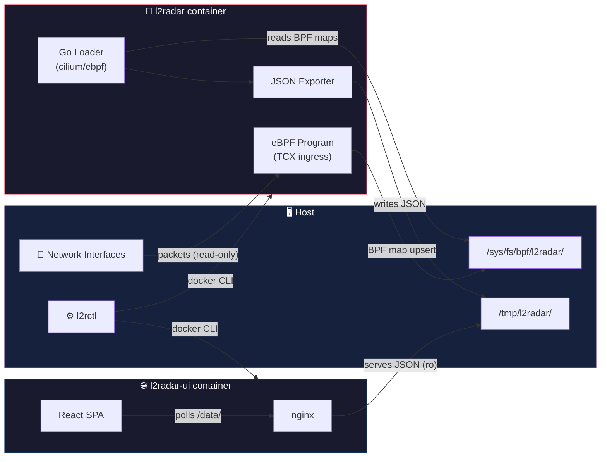
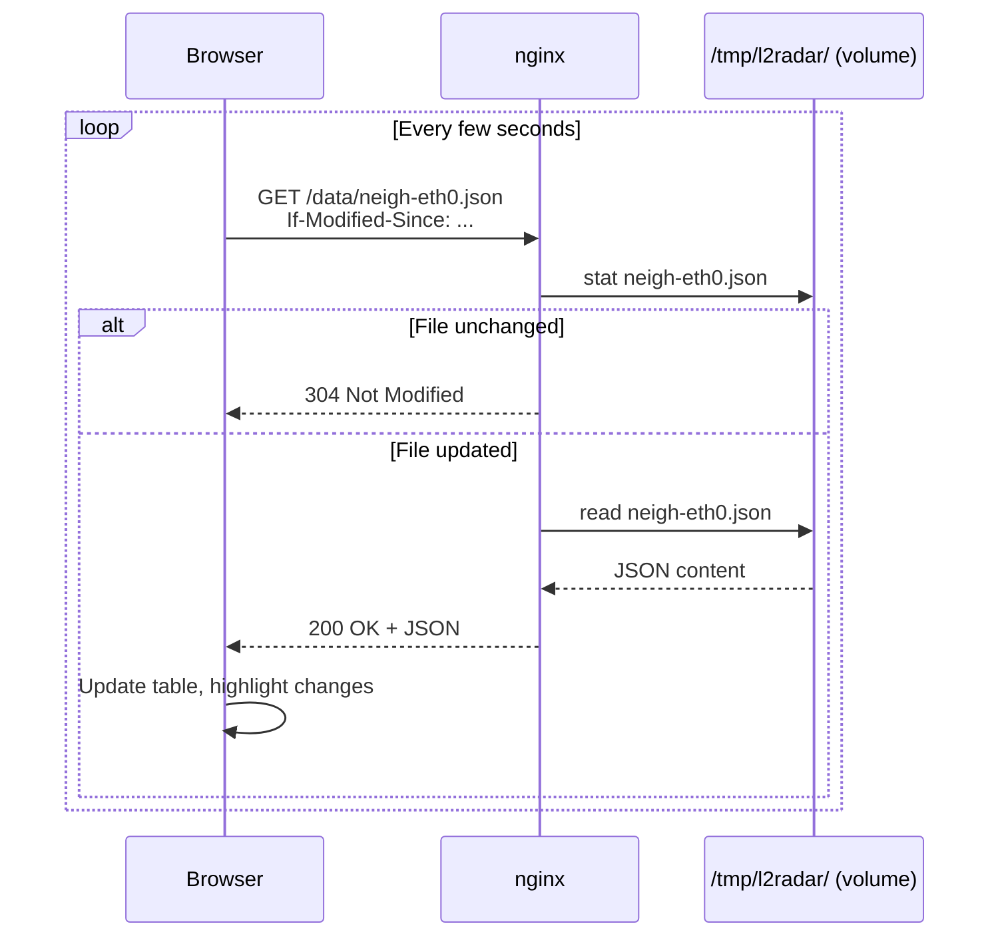
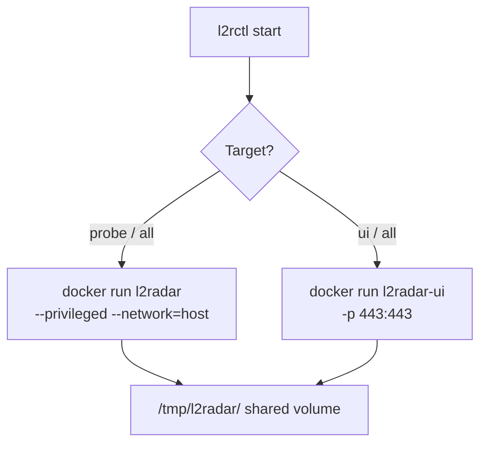
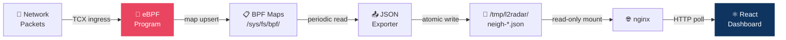

# 🏗️ Architecture

L2 Radar is a passive L2 neighbour monitor built on three components that
communicate through the filesystem — no inter-container networking required.

## Overview



## 📡 eBPF Probe (`l2radar`)

The probe is the heart of L2 Radar. It runs **privileged** with
`--network=host` to access raw network interfaces.

### How it works

1. **eBPF attachment** — A TC (Traffic Control) program is attached via
   [TCX ingress](https://docs.kernel.org/bpf/) to each monitored interface.
   Requires kernel 6.6+.

2. **Packet inspection** — The eBPF program inspects every incoming packet:
   - Records unicast source MACs (filters multicast/broadcast)
   - Parses **ARP** to extract IPv4 ↔ MAC mappings
   - Parses **NDP** (ICMPv6) to extract IPv6 ↔ MAC mappings
   - Handles 802.1Q VLAN-tagged frames

3. **BPF maps** — One hash map per interface, pinned at
   `/sys/fs/bpf/l2radar/neigh-<iface>`. Key = MAC (6 bytes), value = IPs +
   timestamps.

4. **JSON export** — A Go loop reads the BPF maps periodically (default: 5s)
   and writes JSON files to the export directory using atomic writes
   (temp file + rename).

```
📂 /tmp/l2radar/
├── neigh-eth0.json
├── neigh-wlan0.json
└── neigh-enp3s0.json
```

### Key properties

- ⚡ **Passive** — never injects packets; returns `TC_ACT_UNSPEC` to allow
  program chaining
- 🔒 **Pinned maps** are world-readable (`0444`) so the dump subcommand works
  without root
- 📊 Up to **4096 neighbours** per interface, 4 IPv4 + 4 IPv6 per MAC

### JSON export schema

```json
{
  "interface": "eth0",
  "timestamp": "2025-06-01T12:00:00Z",
  "mac": "aa:bb:cc:dd:ee:ff",
  "ipv4": ["192.168.1.10"],
  "ipv6": ["fe80::1"],
  "stats": {
    "tx_bytes": 123456,
    "rx_bytes": 789012,
    "tx_packets": 1000,
    "rx_packets": 2000
  },
  "neighbours": [
    {
      "mac": "aa:bb:cc:dd:ee:ff",
      "ipv4": ["192.168.1.1"],
      "ipv6": ["fe80::1"],
      "first_seen": "2025-06-01T11:55:00Z",
      "last_seen": "2025-06-01T12:00:00Z"
    }
  ]
}
```

Top-level `mac`, `ipv4`, `ipv6` are the monitored interface's own addresses.
The `stats` object contains kernel counters from `/sys/class/net/<iface>/statistics/`.

## 🌐 Web UI (`l2radar-ui`)

The UI is an **unprivileged** container that serves a React dashboard over HTTPS.

### How it works

1. **nginx** serves the static React SPA and exposes the JSON data files
   from the shared volume at `/data/`.

2. **React app** polls the JSON endpoints using `If-Modified-Since` headers.
   nginx returns `304 Not Modified` when files haven't changed — minimal
   bandwidth.

3. **OUI lookup** — The UI ships its own copy of the IEEE OUI database and
   resolves MAC vendor names client-side. No server-side lookups.



### Dashboard features

- 📊 **Summary stats** — total neighbours, per-interface counts, active in
  last 5 minutes
- 🔍 **Search/filter** — filter by MAC, IP, or vendor (partial match)
- 📋 **Sortable columns** — MAC, IPv4, IPv6, first seen, last seen
- 🏷️ **Interface tabs** — combined view or per-interface with stats
- ✨ **Freshness highlights** — new/updated rows flash briefly, stale rows dim
- 📱 **Responsive** — card layout on mobile, table on desktop

### Security

- 🔒 **HTTPS** — self-signed cert auto-generated, or mount your own at
  `/etc/nginx/ssl/`
- 🔑 **Basic auth** — credentials via `auth.yaml`, bcrypt-hashed by the
  entrypoint

## ⚙️ l2rctl (Host Binary)

`l2rctl` is a static Go binary that orchestrates the Docker containers. It
shells out to the `docker` CLI — no Docker SDK dependency.



### Commands

| Command | Description |
|---------|-------------|
| `l2rctl start [all\|probe\|ui]` | Start containers with flags for interfaces, TLS, auth |
| `l2rctl stop [all\|probe\|ui]` | Stop and remove containers (idempotent) |
| `l2rctl status` | Show container status table |
| `l2rctl dump --iface <name>` | Print neighbour table (or `-o json` for raw JSON) |

### Pre-start checks

Before starting a container, `l2rctl` inspects its state:
- **Running** → error (must stop first)
- **Stopped** → auto-remove, then start fresh
- **Not found** → start directly

## 📂 Data Flow Summary



The entire pipeline is **unidirectional**: packets flow in from the left,
neighbour data flows out to the right. The probe never receives commands
from the UI, and the UI never writes to the shared volume.
